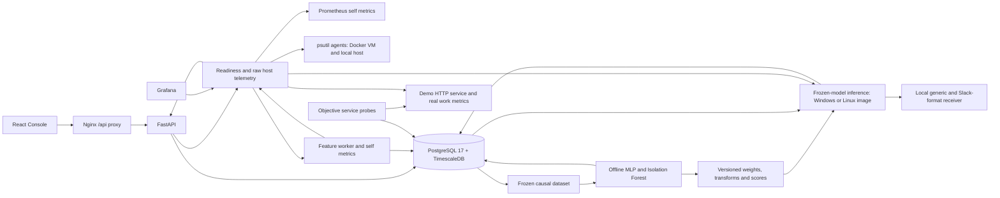

# Sentinel

Predictive infrastructure failure detection: given recent infrastructure and application telemetry, estimate the likelihood of meaningful degradation within the next 5–15 minutes.

**Current work: the SaaS push pipeline is implemented and a real 100-host local Celery/Beat cohort passed. Oracle/Tiger Cloud/Grafana Cloud deployment files are prepared. Docker's filesystem is repaired; remaining local verification needs stable host disk space for the final worker rebuild.** Browser accounts, OWNER/ADMIN/MEMBER roles, PostgreSQL RLS, one-time enrollment, permanent host credentials, encrypted account integrations, audit UI and bounded batched ingestion are implemented. The frozen model and original evaluation remain unchanged. See the [decision record](decision.md), [end-to-end workflow](workflow.md), [current verification](docs/phase3-verification.md), [deployment preparation](docs/phase4-deployment-preparation.md), [tenancy](docs/tenancy.md) and [security](docs/security.md). The earlier [Phase 2 verification](docs/phase2-verification.md) is historical evidence, including preservation of all original demo values at that migration.

The frozen baseline import to [GitHub](https://github.com/vaibhav7506/SENTINEL) completed all 32 commits, spaced by at least five minutes; its monitor is paused. The newer SaaS work is outside that frozen publication manifest and is being verified and prepared as a separate staged series. Six nonroot release images, gated GitHub Actions, Helm/Kubernetes configuration, an Argo CD example and deployment/demo verifiers are implemented. A successful remote CI run, GHCR publication, live deployment and public HTTPS endpoint have not yet been recorded. See [the baseline audit](docs/current-state-audit.md), [baseline verification](docs/baseline-verification.md), [Phase 10 evidence and remaining gates](docs/phase-10.md) and [deployment instructions](docs/deployment.md).

Oracle Always Free Ampere A1 ARM64 is the selected application host after Railway's trial ended. Production uses Tiger Cloud managed TimescaleDB and Grafana Cloud; it does not self-host those development services. The ARM64 image and frozen model have not passed native runtime checks yet; GitHub Actions now requires those gates before ARM images can publish. The Oracle account, VM and DNS are not ready, so hosted endpoints, TLS, remote CI and live tenant isolation remain pending. Existing Railway files are historical preparation.

Real telemetry feeds the frozen MLP and separate Isolation Forest. The model missed every positive held-out window and both Phase 6 live faults; it is not validated for operational prediction. During release checks it also reported high risk while the demo was observed healthy. The safe local demo recorded actual degradation and recovery with no new pre-failure alert. See [the actual evaluation](docs/phase-5.md). Optional RunbookOS diagnostics proposals default to disabled, use mock intake, and require human approval; Sentinel does not execute remediation.

## Why prediction differs from alerting

A current high metric is a present condition, not a prediction. Stable 80% memory usage may be healthy; a rapid rise from 60% to 78% to 91% may provide an early signal. The offline model now consumes trends and interactions, and its warnings are evaluated against actual future degradation timestamps. This small local evaluation does not demonstrate useful held-out prediction.

## Local quick start

Requires Docker Desktop with Linux containers and Compose v2, and Python (3.13+ is sufficient for the credential and verification scripts). Local backend development requires Python 3.14; uv can install it. Frontend development requires Node 22.13+ and npm.

```sh

python scripts/init_env.py

docker compose up --build

```

`init_env.py` creates ignored `.env` credentials randomly and refuses to overwrite an existing file. Once images are built, `docker compose up` starts the same stack. The API applies Alembic migrations before serving requests. Database data, Prometheus history, and Grafana settings persist in named volumes.

Open the console and sign up to create a new account. To access the preserved demo data, create its first owner instead, then sign in with that email and your chosen password:

```sh
docker compose exec sentinel-api python -m app.saas.bootstrap --email YOUR_EMAIL
```

The command prompts privately for a password and refuses to replace an existing owner. There is no default demo password. Owners create team members through Team & account. Owners and admins enroll machines through Hosts → Add host; the install command displays a temporary token once. Configure `SAAS_PUBLIC_API_URL` and `SAAS_ALLOWED_ORIGINS` for your actual browser address, and `SAAS_ALERT_ALLOWED_HOSTS` for approved HTTPS integration destinations. Grafana remains an operator tool separate from the account console.

For the complete prediction chain, start the existing frozen Python 3.14 inference worker with the optional Compose profile:

```sh
docker compose --profile inference up --build
```

This profile registers the frozen model idempotently before starting inference. Allow about 15 minutes for real feature coverage on an empty Prometheus volume. Inference metrics remain on the private Compose network. Run one inference worker per database; stop a separately launched native worker before using this profile. Optional webhooks and the LLM remain disabled until configured. A local receiver in another container must share the worker's loopback namespace or use HTTPS; plain HTTP container hostnames are rejected.

| Service | Local address | Purpose |

| --- | --- | --- |

| Console | http://localhost:5173 | Host health, predictions, incident evidence and model evaluation |

| API | http://localhost:8000/docs | FastAPI OpenAPI |

| API liveness | http://localhost:8000/health | Process liveness only |

| API readiness | http://localhost:8000/ready | PostgreSQL, TimescaleDB, migration state and Prometheus |

| Prometheus | http://localhost:9090 | Raw metric store; agent, application and self scrapes |

| Grafana | http://localhost:4300 | Provisioned datasource and three real dashboards |

| Demo service | http://localhost:8001 | Simple real HTTP application |

| PostgreSQL | localhost:15432 | TimescaleDB-enabled PostgreSQL 17 |

Log in to Grafana using `GRAFANA_ADMIN_USER` and `GRAFANA_ADMIN_PASSWORD` from your local `.env`. No default password is committed. All published ports bind only to loopback. Change port settings in `.env` if a local port is occupied.

```sh

python scripts/verify_stack.py

docker compose ps

docker compose logs sentinel-api sentinel-worker

docker compose down

```

`verify_stack.py` validates HTTP responses, frontend API proxying, readiness details, and all nine running services. It returns nonzero on failure. `down` preserves named volumes. Do not remove database volumes unless you intend to erase their data.

## Implemented architecture



Prometheus stores the original demo telemetry. The worker queries it every 60 seconds, computes features over a 15-minute observation window, and stores derived windows in TimescaleDB. Phase 2 adds account ownership, authentication and enrollment tables, and a raw metrics hypertable for enrolled hosts. Enrolled host metrics are visible in their account; distributed prediction for these hosts remains outside Phase 2. Experiment and failure-event records come from real execution and probes; ModelVersion and EvaluationRun store actual offline training results. Online predictions contain actual scores. Fresh threshold crossings conditionally create persisted incidents, explanations, summaries and deduplicated alert deliveries. Local receiver acceptance is evidence of delivery, not evidence of a correct forecast. Actual remediation execution remains external and unverified.

## Repository

- `agent`: psutil sampling, Prometheus exporter, protected enrollment identity, authenticated metric upload, executable entry point, Docker image and tests.

- `backend/app/api`, `core`, `db`, `schemas`, `services`: health routes, validated settings, JSON logging, engine lifecycle, readiness checks.

- `backend/app/saas`: account authentication, tenant data access, RBAC, host enrollment, credentials, integrations, immutable audit and private demo-owner bootstrap.

- `backend/app/workers`: feature generation and objective service-observation workers; no model inference.

- `backend/alembic`: extension, domain, experiment lifecycle, and probe-criteria migrations.

- `backend/tests`: dependency failure, timeout, configuration, logging and HTTP contract tests.

- `frontend`: React and TypeScript console with cookie authentication, account and role context, team management, host enrollment, private integrations and operational views.

- `training`: chronological dataset building, future labels, train-only transforms, PyTorch training, healthy-input Isolation Forest, calibration and offline evaluation; separate environment and lockfile.

- `inference`: frozen model scoring, bounded SHAP, factual provider abstraction, persistent incident/delivery handling, separate Windows CPU environment and an independently locked Linux CPU image.

- `demo-service`: FastAPI app with health, metrics, and bounded real work.

- `prometheus`, `grafana/provisioning`: local monitoring service configuration and datasource provisioning.

- `compose.yaml`, `scripts`, `Makefile`, `docs`: local orchestration, verification, developer commands and phase records.

- `.github/workflows`, `infra/helm`, `infra/kubernetes`, `infra/gitops`: validation/publication gates, deployment chart, namespace and operator-adapted Argo CD example. These files are not proof of a completed external deployment.

- `sentinel`, `config`, `tests`, `data`: original service polling/SQLite prototype, preserved outside the new platform. Compose never runs this code or modifies its existing data.

The root Python package declares only dependencies imported by the preserved prototype. ML dependencies are isolated in separate training and inference projects. Each active Python project has a separate uv environment and lockfile.

## Development and checks

Install uv using the official instructions: https://docs.astral.sh/uv/getting-started/installation/ . Commands run from the repository root unless a `cd` is shown.

```sh

uv sync --project backend --frozen

uv sync --project demo-service --frozen

uv sync --frozen

cd frontend

npm ci

npm run dev

```

The Vite dev server proxies `/api/*` to the API at port 8000. Run the API from the repository root so it loads the root `.env`:

```sh

uv run --project backend alembic -c backend/alembic.ini upgrade head

uv run --project backend uvicorn app.main:app --reload --no-access-log

uv run --project backend python -m app.workers.features

```

Use `POSTGRES_HOST=127.0.0.1` for native Windows migrations to avoid slow IPv6 fallback; Compose overrides it with the database service name. The URL is constructed using SQLAlchemy's URL API so passwords with reserved characters are handled safely.

```sh

uv run --project backend pytest backend/tests

uv run --project backend ruff check backend

uv run --project backend ruff format --check backend

uv run --project backend mypy --config-file backend/pyproject.toml backend/app

uv run --frozen pytest tests

cd frontend

npm run lint

npm run typecheck

npm run build

```

The Makefile offers equivalent core commands where `make` is available. Docker builds use locked dependencies. Grafana provides detailed telemetry dashboards, and the Console combines observed health with model and incident evidence. Verify its data against the live database with `uv run --project backend python scripts/verify_console.py`; check SQL joins in a disposable database with `uv run --project backend python scripts/check_console_database.py`.

## Health and logging

`/health` returns HTTP 200 for a live process independently of dependencies. `/ready` runs bounded concurrent database and Prometheus checks and returns HTTP 200 or 503 with per-dependency statuses. Database readiness checks connectivity, extension availability and the required migration revision. Driver errors are replaced with safe fixed messages. Requests receive internally generated IDs; structured logs include method, path, response code and elapsed time, without query strings or request bodies.

The feature worker handles SIGTERM/SIGINT and exposes heartbeat, committed-window count, cycle error count, generation duration, and last successful-cycle time on internal port 8002. See [the feature contract](docs/features.md) for ordering, units, missing values, and host/service mapping.

## Release and deployment

The [deployment guide](docs/deployment.md) covers builds, private credentials, immutable image digests, managed TimescaleDB, TLS, Helm installation, optional existing Argo CD, verification and rollback. The workflow publishes six GHCR images only after every validation job passes on a push to `main`. Application images are scanned for critical vulnerabilities, including unfixed findings. Production Helm values require image digests and an external database; demo mode offers retained TimescaleDB, Prometheus and Grafana volumes.

The production Console uses bcrypt Basic authentication over trusted HTTPS and a server-side API bearer token. API reads require that token; the public proxy rejects chaos and all mutation methods. Production disables chaos independently. Ordinary workloads have no Kubernetes API permissions; Prometheus has namespace-only pod discovery, and node agents have documented read-only host access with no API token. Network policies require an enforcing CNI and node agents also require firewall restrictions. Authentication/rate state is scoped to the configured single replica. See [the local release evidence](docs/phase-10.md) for what has actually been exercised.

Supply the approved GitHub/GHCR repository, Kubernetes context, storage/ingress configuration and hostname/TLS Secret before completing the external gates. Preserve the model's actual outputs during the deployed safe demo; a failed prediction must remain a failed prediction.

## Limitations

The running stack is a local development environment. Grafana dashboards query real host, application and Sentinel metrics. Actual offline metrics are saved, but the held-out model has zero recall and poor calibration. Zero false warnings in five non-failure minutes does not establish a low operational false-alert rate; later live high-risk scores while the service was healthy reinforce this limitation. Only authenticated, allowlisted demo chaos mutations are implemented. CI/CD configuration and the deployment chart have local validation, but remote execution and the agent DaemonSet deployment remain unverified.

Controlled failure experiments provide labeled data but do not guarantee that the model generalizes to production incidents. Later training should include historical incidents with objective event times, trustworthy telemetry and held-out environments. The real local dataset is small; its chronological partitions have purged input/label overlap, but each contains correlated minute windows from one host. Training and validation positives cover latency faults; test positives cover one HTTP-error event. Generalization remains unproven.

See `docs/dependencies.md` for the version verification and lock policy, and the phase acceptance records in `docs`. See [telemetry instructions](docs/telemetry.md) for executable/container/node scopes, agent configuration, load generation and Grafana dashboards.


## Feature verification

```sh
uv run --project backend python scripts/check_feature_database.py
uv run --project backend python scripts/verify_features.py
```

The first command creates and removes an isolated test database to check migrations and transaction behavior. The second observes the running worker for 75 seconds and saves real results to `docs/feature-validation.json`. Keep the demo and agents running. Native Windows feature workers use a psycopg-compatible selector event loop.

## Controlled chaos and dataset generation

```sh
python scripts/init_chaos_env.py --enable-local-demo
docker compose up --build -d
uv run --project backend python scripts/run_chaos_campaign.py
uv run --project backend python -m training.build_dataset
```

Chaos defaults to disabled and only supports bounded latency and HTTP 503 injection in the fixed local demo. The observer confirms actual breaches and recovery. The campaign waits for an observed healthy baseline, and the dataset uses the default 600-second prediction horizon with coverage-based negatives and experiment-group splits. See [chaos and labels](docs/chaos-dataset.md) for gates, criteria, exclusions, artifacts, and small-data limitations. No model is trained by these commands.


## Governed proposal integration

`RUNBOOKOS_ENABLED=false` keeps proposal intake off while scoring and local alerting continue. Set it to true only to use the clearly labeled mock adapter. The default advisory cutoff is `RUNBOOKOS_PROPOSAL_THRESHOLD=0.995`; eligibility also requires the unchanged model threshold and a fresh, unexpired forecast. `RUNBOOKOS_BASE_URL` and secret `RUNBOOKOS_API_KEY` settings are reserved for a verified intake contract and are not used by the mock. Read-only `/remediation/status` and `/remediation/proposals` expose actual configuration and records. See [Phase 7](docs/phase-7.md) for the historical isolated demonstration, state transitions and human-approval boundary.

## Models, explanations and alert evidence

Future labels use objectively observed degradation within the configured 600-second horizon, with coverage requirements for negatives and exclusions around recovery. Chronological experiment groups are separated and overlapping observation/label intervals are purged. Transforms fit training data only. The 209-feature MLP trains offline with a fixed seed, early stopping, validation calibration and a validation-selected cutoff; Isolation Forest fits fully observed healthy training inputs and reports a separate unfamiliarity score. Test metrics are reported without adapting the cutoff to the test set. See [features](docs/features.md), [labels and datasets](docs/chaos-dataset.md) and [training/evaluation](docs/phase-5.md).

Frozen inference verifies artifact hashes, schema and finite parameters before scoring fresh windows. SHAP associates inputs with a model output; it does not identify causes. The summary provider uses supplied telemetry/evaluation facts, labels poor model validation, and falls back to deterministic text when an optional LLM is disabled or unavailable. External LLM and webhook destinations require explicit configuration and authorization; none were used for release verification. Generic and Slack-format deliveries use persisted IDs, bounded retries and restart deduplication. Ambiguous delivery remains unknown, and an expired forecast does not imply service recovery. See [Phase 6 explanations and delivery](docs/phase-6.md) and [Phase 9 hardening](docs/phase-9.md).

Run `make demo` or `uv run --project backend python scripts/run_demo.py` against the explicitly enabled local demo to record one bounded fault with real baseline, breach, recovery and alert timing. The script refuses stale/unhealthy prerequisites and never forces a score, explanation or warning. New local receiver receipts are stored under ignored `.runtime/local-webhook-receipts.jsonl`; historical Phase 6 receipts remain immutable.
