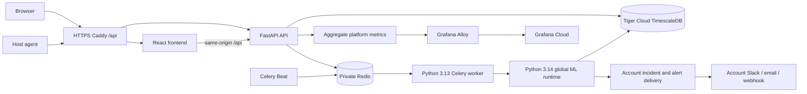

# How Sentinel's parts connect

This describes the current SaaS path and distinguishes local verification from the intended hosted path. The local API/console runs, but the Oracle, Tiger Cloud and Grafana Cloud connections have not been accepted live.

## 1. Identity and host onboarding

The browser signs up or logs in through `backend/app/saas/auth.py`. A session and CSRF token identify the account and role. OWNER/ADMIN operations in `backend/app/saas/operations.py` issue a short-lived, one-time enrollment token. The agent downloads the package/installer, enrolls once, stores its host key with restricted local permissions, and reuses that identity after restart. The server stores a key hash and a prefix for lookup; it does not return the permanent key after enrollment. Revocation invalidates future ingestion. See [agent enrollment](docs/agent-enrollment.md) and [tenancy](docs/tenancy.md).

## 2. Telemetry transport and storage

The agent collects actual host measurements, batches them under schema version 1 and sends them outward over HTTPS to `POST /agent/v1/metrics`. `backend/app/saas/ingestion.py` checks the bearer key, looks up the server-owned account and host, enforces Redis-backed host/account limits, validates size, timestamps and metric ranges, and inserts deduplicated samples. TimescaleDB stores raw samples with account, host and time. `last_seen` and the negotiated reporting interval drive Online, Stale and Offline status. Offline is an observed heartbeat state, not an ML forecast.

## 3. Scheduling, features and prediction

`queue/celery_app.py` configures Beat and the Redis broker. Beat asks `inference/push_runner.py` for active hosts due at the next feature boundary, then queues account/host/window identifiers. A Celery worker verifies ownership before reading telemetry, loads only that host's window, checks coverage and the frozen feature schema, and runs the shared MLP plus anomaly detector in the Python 3.14 subprocess. The database stores account-owned feature windows and predictions. A host/window/model uniqueness rule and lease make task retries idempotent. No account's raw samples are sent into another account's API result.

## 4. Incident, explanation and delivery

The frozen model threshold decides whether a prediction enters the incident path. SHAP explains model features when useful. The optional LLM receives structured evidence from the same account; if unavailable, a deterministic summary remains. The account's encrypted alert destinations are selected, and a separate delivery task sends a deduplicated alert to approved Slack, email or HTTPS webhook endpoints. RunbookOS integration can propose a mock advisory action only; a human must approve it and Sentinel never executes destructive remediation. A high score is not proof of a future failure: the held-out model recall/F1 remain zero.

## 5. Browser and platform monitoring

React calls the same-origin `/api` proxy. Authenticated, account-scoped APIs supply hosts, recent metrics, predictions, incidents, alert settings, team and audit data; OWNER-only actions remain server-enforced. The API exposes a separate aggregate platform metrics registry. Alloy scrapes only this registry and sends allowlisted labels and counters to Grafana Cloud. Customer raw telemetry stays in TimescaleDB. Local development instead uses the existing self-hosted TimescaleDB, Prometheus and Grafana containers.

## 6. Build, release and deployment

Source moves from GitHub through GitHub Actions tests, native ARM64 builds and image scans. Successful main-branch gates may publish immutable API, frontend and push-worker digests. On an Oracle Ampere A1 VM, `infra/oracle/compose.yaml` runs those images with private Redis and Caddy. A controlled, single migration runs before application traffic; the API readiness endpoint checks the database and expected revision. Tiger Cloud supplies managed TimescaleDB over SSL. Grafana Cloud receives only platform metrics. The VM, DNS, TLS, managed database connection, remote CI and Cloud metrics require live checks before this becomes a deployment claim. See [deployment preparation](docs/phase4-deployment-preparation.md) and [decision record](decision.md).

## Where to look when a step fails

| Symptom | First boundary to inspect |
| --- | --- |
| Agent receives 401 | Enrollment/key hash, revocation and bearer authentication |
| Agent receives 429 or 503 | Redis host/account buckets or Redis availability |
| Host remains Offline | Agent upload response, stored `last_seen`, reporting interval |
| No fresh prediction | Beat due-host selection, Redis queue, Celery worker, telemetry coverage and model registration |
| Duplicate or cross-account result | Account-scoped session, PostgreSQL RLS, host/window/model uniqueness and worker ownership check |
| No incident or alert | Actual threshold crossing, account channel state, delivery lease and receiver response |
| Blank account dashboard | Browser session/CSRF, same-origin proxy and account-scoped API response |
| Grafana Cloud missing data | API aggregate registry, Alloy allowlist, private network and remote-write credentials |

The measured local 100-host test and remaining acceptance items are in [Phase 3 verification](docs/phase3-verification.md). Do not use that synthetic cohort as a production capacity or forecasting claim.
